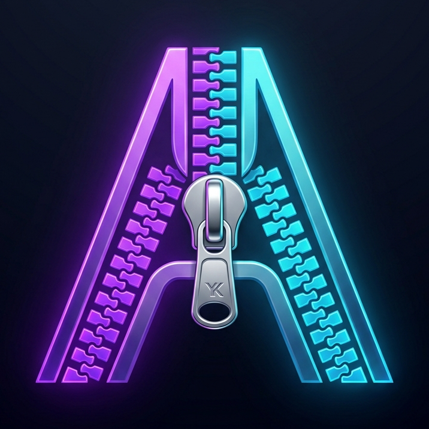

# Athros

<p align="center">
  
</p>

<h3 align="center">Athros — Precision 60fps Video Frame Interleaver</h3>

<p align="center">
  
  
  
  
  
</p>

---

## Overview

**Athros** is a web application designed to interleave two video streams frame-by-frame. It splits both videos into equal frame segments (e.g. 6 frames at 60 FPS) and stitches them back together in a perfect alternating sequence: 

$$\text{Video A (Frames } 0\text{-}5) \rightarrow \text{Video B (Frames } 0\text{-}5) \rightarrow \text{Video A (Frames } 6\text{-}11) \rightarrow \text{Video B (Frames } 6\text{-}11) \rightarrow \dots$$

### The In-Memory Architecture
Unlike standard video editing scripts that split files into thousands of small `.mp4` chunks on disk before merging them, Athros uses a **zero disk-bloat sequential frame engine**. By holding only one chunk in memory at a time and streaming it directly to the output writer using OpenCV, the app maximizes processing speed, eliminates disk writes, and prevents filesystem errors.

---

## ⚡ Key Features

* **Auto-Duration Match**: Automatically detects durations, calculates minimum frame lengths, and trims the longer video so both files sync to the exact millisecond.
* **Resolution Auto-Resizing**: Dynamically detects resolution differences. If Video B's dimensions differ from Video A's, B is automatically resized in memory to match A's scale, preventing output stream corruption.
* **Dynamic Interleave Configuration**: Set the interleave duration by **Frames** (e.g., 6 frames) or by **Seconds** (e.g., 0.1s). The UI automatically converts values at 60 FPS and validates input boundaries.
* **H.264 Browser Native Codec**: Encodes the output video using the **`avc1` (H.264)** codec, ensuring immediate native playback in HTML5 browser players without requiring third-party media players.
* **Premium Glassmorphic Dashboard**: Dark mode design featuring custom drag-and-drop zones, active file staging metadata displays, an animated progress pulse, a live log console, and a built-in playback viewer.

---

## 📐 How It Works (Frame Interleaving Matrix)

Assuming a Target Framerate of **60 FPS** and an **Interleave Interval of 6 frames (0.10 seconds)**:

| Output Position | Time Range (Seconds) | Source Video | Frame Range from Source |
|:---:|:---:|:---:|:---:|
| **1** | $0.00\text{s} - 0.10\text{s}$ | Video A | Frames $0 - 5$ (First 6 frames) |
| **2** | $0.10\text{s} - 0.20\text{s}$ | Video B | Frames $0 - 5$ (First 6 frames) |
| **3** | $0.20\text{s} - 0.30\text{s}$ | Video A | Frames $6 - 11$ (Next 6 frames) |
| **4** | $0.30\text{s} - 0.40\text{s}$ | Video B | Frames $6 - 11$ (Next 6 frames) |
| **5** | $0.40\text{s} - 0.50\text{s}$ | Video A | Frames $12 - 17$ |
| **6** | $0.50\text{s} - 0.60\text{s}$ | Video B | Frames $12 - 17$ |

---

## 📂 Directory Structure

```
Frames_swap/
├── backend/
│   ├── app/
│   │   ├── __init__.py
│   │   ├── main.py              # FastAPI web server, routes, and background queue
│   │   ├── services/
│   │   │   ├── __init__.py
│   │   │   └── video_processor.py   # Core H.264 sequential stream interleaver
│   │   └── static/              # Client static assets
│   │       ├── index.html       # Single Page Application HTML structure
│   │       ├── styles.css       # Premium CSS layout and animations
│   │       ├── app.js           # Client-side operations, polling, and logs
│   │       └── logo.png         # AI-generated cropped app logo
│   ├── test_processor.py        # Automated color-verification test suite
│   ├── Dockerfile               # Debian-slim server image configuration
│   └── requirements.txt         # Server library dependencies
├── docker-compose.yml           # Container orchestration configuration
├── run.py                       # Project entry point script
├── .gitignore                   # Exclusions for temporary assets
└── README.md                    # Project documentation (this file)
```

---

## ⚙️ Setup and Running

### Method 1: Local Setup (Recommended)

1. **Clone and navigate to the project directory**:
   ```bash
   cd /Users/debojoteedutta/VSC_repos/Frames_swap
   ```

2. **Create and activate a virtual environment**:
   ```bash
   python3 -m venv venv
   source venv/bin/activate
   ```

3. **Install dependencies**:
   ```bash
   pip install -r backend/requirements.txt
   ```

4. **Launch the server**:
   ```bash
   python run.py
   ```
   Open your browser and navigate to **[http://localhost:8000](http://localhost:8000)**.

### Method 2: Run with Docker Compose

You can build and spin up the application in a local container. This handles all OpenCV C-library dependencies internally:

```bash
docker-compose up --build
```
Access the application at [http://localhost:8000](http://localhost:8000). Code changes inside `backend/app/static` will hot-reload instantly.

---

## 🌐 API Specification

### 1. Upload Videos
* **Endpoint**: `POST /api/upload`
* **Content-Type**: `multipart/form-data`
* **Form Fields**:
  * `video_a`: Primary video file (binary)
  * `video_b`: Secondary video file (binary)
  * `interval_frames`: Interleave chunk size in frames (integer, optional, default: `6`)
* **Response (Success)**:
  ```json
  {
    "task_id": "8f3e58c0-8a7e-4623-863a-2374e625a6f2",
    "status": "pending"
  }
  ```

### 2. Check Task Status
* **Endpoint**: `GET /api/status/{task_id}`
* **Response (Processing)**:
  ```json
  {
    "status": "processing",
    "progress": 42,
    "error": null
  }
  ```
* **Response (Completed)**:
  ```json
  {
    "status": "completed",
    "progress": 100,
    "error": null,
    "download_url": "/api/download/8f3e58c0-8a7e-4623-863a-2374e625a6f2"
  }
  ```

### 3. Download Video
* **Endpoint**: `GET /api/download/{task_id}`
* **Response**: Raw video stream with headers: `Content-Type: video/mp4`, `Content-Disposition: attachment; filename="interleaved_output.mp4"`.

---

## 🧪 Testing

I have built a dedicated programmatic validation script to test the video processor against frame loss, duration sync, and alternating patterns.

### Run Verification Test
```bash
python backend/test_processor.py
```
**Test Workflow**:
1. Creates `test_video_a.mp4` (60 frames of solid **Red** at 60fps).
2. Creates `test_video_b.mp4` (120 frames of solid **Blue** at 60fps).
3. Interleaves them through `video_processor` with a target frame chunk of 6.
4. Asserts that the output contains exactly **120 frames** (trimming Video B to 60 frames and interleaving $60 + 60 = 120$).
5. Asserts the framerate is exactly **60.0 FPS**.
6. Inspects the color of each frame sequentially, checking that frames 0-5 are Red, frames 6-11 are Blue, frames 12-17 are Red, etc.
